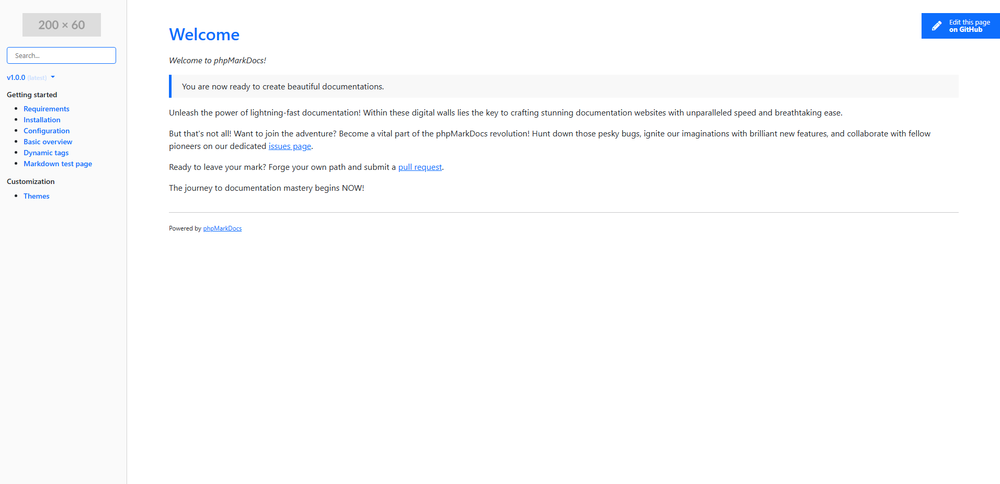
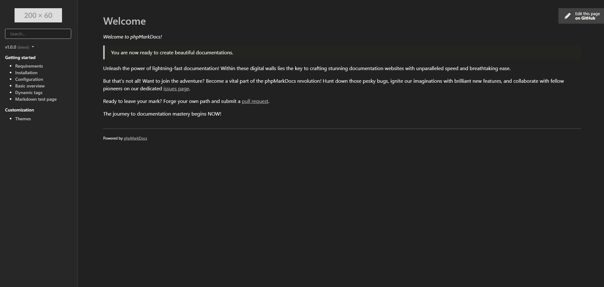

# phpmarkdocs

Lightweight markdown-based documentation website generator written in PHP. Simply create your markdown files and it will do the rest for you, let's create a beautiful and responsive documentation website.

## Features
- Lightweight (less than 100KB gzipped)
- No static HTML files
- Support for multiple documentation versions
- Theme customization with automatic light/dark mode
- Syntax highlighting support with highlightjs
- Automatic routing
- Automatic menu generation
- Support for search in files
- Responsive layout
- Supports flavored Markdown and Markdown Extra
- Supports direct editing on GitHub
- Large compatibility with all basic hosting providers

## Getting started
[Explore the documentation](https://esyede.my.id/phpmarkdocs) to get started.

The documentation website itself was made with phpMarkDocs, so this is a great example on how to get started. The docs source code is bundled within this project.

## System requirements
- PHP 5.4 or newer
- PHP mbstring extesnsion
- Apache 2.4 or newer

## Todo
 - [ ] Markdovn caching
 - [ ] Support for other webservers

 ## License
 This program is licensed under the [MIT License](http://opensource.org/licenses/MIT)
